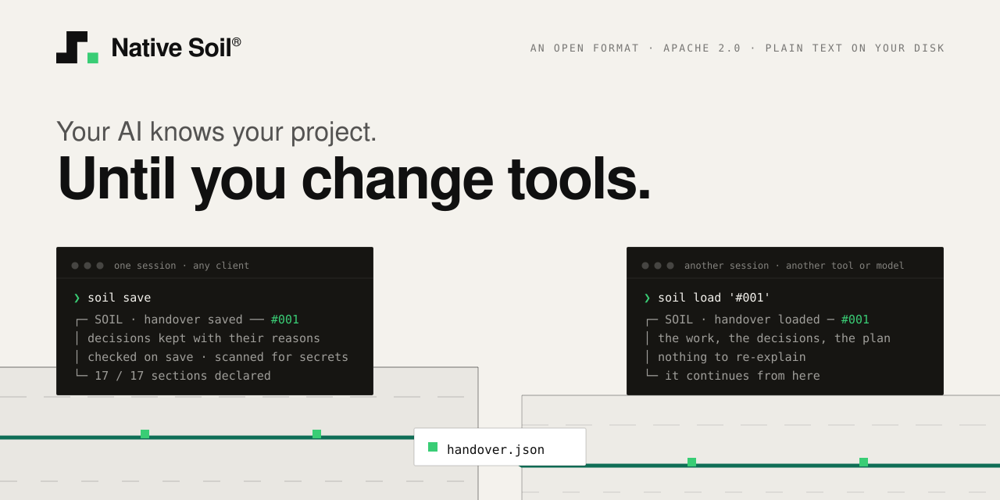
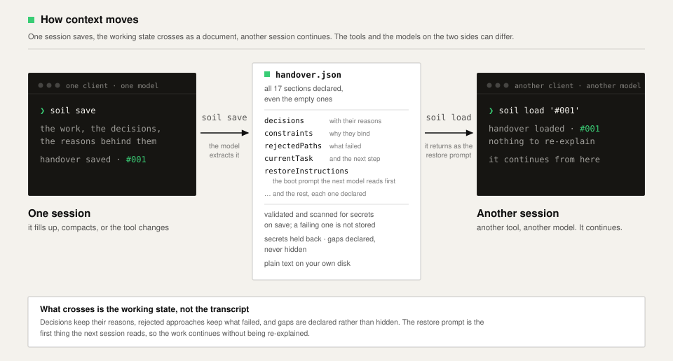
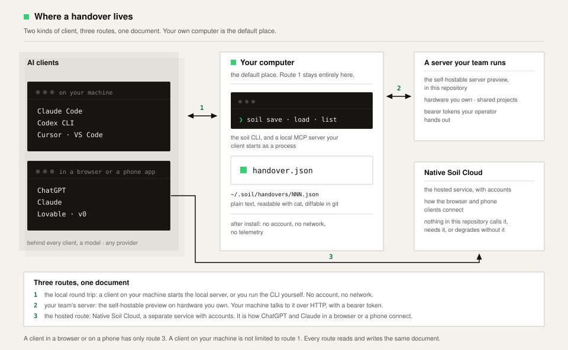

# Soil Handover

[](https://github.com/nativesoil/handover/actions/workflows/ci.yml)
[](.github/workflows/ci.yml)
[](docs/compatibility.md)
[](LICENSE)

**Your AI knows your project. Until you change tools.**



<details>
<summary>Detailed diagram description</summary>

The cover of the Soil Handover repository. On an off-white ground, the Native
Soil wordmark sits above the tagline pair: your AI knows your project, until
you change tools. Below, two carbon terminal panels stand on layered ground
that is split by a break between them. In the left panel the command soil save
stores handover 001, checked on save and scanned for secrets; in the right
panel the command soil load brings it back in another tool or another model,
and the session continues from there. The layers of the ground stop at the
break. One
deep green seam is the only layer that crosses it, marked by small green seed
blocks, and where it crosses it carries a white card stamped handover.json.

</details>

Soil Handover is an open JSON format and local toolchain for carrying the
working state of an AI-assisted project between agents, tools and model
providers. It preserves decisions and their reasons, constraints, rejected
approaches, the current task and the next step in a human-readable,
machine-validated document.

Open format · Local by default · No account or telemetry required

**[Build and try the developer preview →](#build-and-try-the-developer-preview)**

[Build an implementation](spec/README.md) ·
[Connect an MCP client](docs/quickstart.md) ·
[Run the team server](docs/server.md) ·
[Hosted service](https://nativesoil.dev)

## What a handover looks like

A real subset, from
[docs/examples/readme-example.json](docs/examples/readme-example.json); the
full document has 17 sections and validates against the schema on every test
run. Every section declares its status, so a section the thread never covered
is a visible gap, not a silent omission.

<!-- example: bound readme-example -->

```json
{
  "soilHandover": "1.0",
  "projectId": "orchard-checkout",
  "title": "Checkout rework: payment retry design",
  "sections": {
    "decisions": {
      "status": "available",
      "summary": "The address is kept in the server session, so a declined card re-mounts the payment widget with the address intact. Locked because the current code returns the subscriber to an empty form, and re-entering everything is where retries are abandoned."
    },
    "constraints": {
      "status": "available",
      "summary": "Card data never touches Orchard's servers. The hosted widget stays the only place card details are entered. This is a compliance boundary, not a preference."
    },
    "currentTask": {
      "status": "available",
      "summary": "Designing the payment retry path: about half done, the session shape is agreed, the re-mount behaviour is not written yet. Next step: write the decline message, because the founder wants to review that string before the logic lands."
    },
    "rejectedPaths": {
      "status": "missing",
      "summary": null
    }
  }
}
```

## Build and try the developer preview

Nothing here is on a package registry yet; installation becomes one line at
the first release. Today, from the root of a checkout of this repository:

```bash
pnpm install && pnpm build

# 1. print the recipe and paste it into the session you want to keep
node packages/cli/bin/soil.js save

# 2. the model answers with one JSON block. paste it back:
node packages/cli/bin/soil.js save -

# 3. anywhere else, in another tool or model:
node packages/cli/bin/soil.js load '#001'
```

Step 3 prints a paste-ready restore prompt: paste it into the new session and
keep working. Your handovers are in `~/.soil/handovers/`, one JSON file each,
readable with `cat`: if this repo vanished tomorrow they would still be
readable, which is rather the point.

Every save answers with a receipt. Gaps are stated, never hidden, and so is
what was held back on purpose. This is the real output of
`soil save examples/orchard-checkout.json`, checked against the renderer by
`scripts/check-cards.mjs`:

<!-- card: bound saved-orchard -->

```
  ┌─ SOIL · handover saved ──────────────────── #001 ─
  │
  │   Checkout rework: address step split, payment
  │   retry pending
  │   orchard-checkout
  │
  ├─ written by ──────────────────────────────────────
  │
  │   client      claude-code
  │   model       opus-4.8
  │   provider    anthropic
  │   recipe      1.0.0
  │
  ├─ what this document carries ──────────────────────
  │
  │   17 / 17 sections carrying content
  │   provenance  repo_verified, user_locked_memory,
  │               model_reported, owner_observed
  │
  ├─ stated gaps ─────────────────────────────────────
  │
  │   ▸ Conversion numbers since Monday's
  │     address-step deploy had not accumulated at
  │     capture, so the effect of that deploy is
  │     unknown.
  │   ▸ The payment provider's documented behaviour
  │     on widget re-mount after a decline could not
  │     be confirmed, because the sandbox was
  │     returning intermittent errors.
  │
  ├─ unresolved contradictions ───────────────────────
  │
  │   ▸ The bundle ceiling is described as 180 KB
  │     gzipped in the project notes and as 'about
  │     175' in an earlier conversation. The
  │     stricter figure is used here; the exact
  │     number was not re-confirmed.
  │
  ├─ held back · by design ───────────────────────────
  │
  │   ▸ Payment provider API credentials exist and
  │     are set as environment variables in the
  │     deployment platform. Values withheld.
  │   ▸ The delivery partner webhook signing secret
  │     exists and is configured in the deployment
  │     platform. Value withheld.
  │
  ├─ local ───────────────────────────────────────────
  │
  │   stored on this machine · no account · no
  │   network
  │
  └─ load it in another thread, model, or tool

          ❯ soil load #001
```

The worked example, end to end, is in [`examples/`](examples/README.md), and
[docs/quickstart.md](docs/quickstart.md) carries on from here.

> **Open source and hosted service.** This repository is the open format and
> tools, and works entirely locally. Native Soil Cloud is the optional hosted
> service; [nativesoil.dev](https://nativesoil.dev) is where to read about
> that one, and nothing in this repository calls it, needs it, or degrades
> without it.
>
> **Soil Handover** is the open format and everything in this repository.
> **`soil`** is the command.
> **Native Soil Cloud** is the optional hosted service from Native Soil (the
> brand and company).

## Why a handover, not a transcript?

A session fills up, compacts or ends, and the work moves: another tool,
another model, a teammate. A transcript preserves what was said, not which
decisions are current or why constraints bind. A summary is smaller, and
compression drops the reasons first: "use X" survives, "use X because Y failed
under load, and do not reopen Z" often does not. A decision without its reason
is a decision waiting to be relitigated.

So a handover extracts the working state into named sections: decisions keep
their reasons, rejected approaches keep what failed, constraints keep why they
bind, current work keeps its blockers and next step, and what still holds is
kept structurally apart from what was only true at the capture. Gaps are
declared, never hidden. Memory features sit on the other side of this
boundary: memory helps an agent remember inside one system, Soil Handover
moves the working state between systems.



<details>
<summary>Detailed diagram description</summary>

How context moves, left to right. One session in one client, on one model: the
command soil save captures the work, the decisions and the reasons behind
them, and stores handover 001. In the centre, what crosses: handover.json, a
document that declares all 17 sections, even the empty ones, among them
decisions with their reasons, constraints and why they bind, rejected paths
and what failed, the current task and the next step, and the restore
instructions, the boot prompt the next model reads first. On save the document
is validated against the schema and scanned for credential-shaped values and
private paths; a document that fails either gate is not stored, and gaps are
declared rather than hidden. On the right, another session in another client,
on another model: soil load brings handover 001 back as the restore prompt,
nothing has to be re-explained, and the work continues from there.

</details>

The whole move in one picture: one session saves, the document crosses,
another session continues.

The full argument, including drift and the context ghost, is in
[docs/concepts.md](docs/concepts.md).

## How it works



<details>
<summary>Detailed diagram description</summary>

Where a handover lives, left to right. The AI clients as plain text names on a
layered ground, because behind every client runs a model, from any provider:
Claude Code, Codex CLI, Cursor and VS Code run on your machine; ChatGPT,
Claude, Lovable and v0 live in a browser or a phone app. In the centre, your
computer, the default place: the soil command line and a local MCP server your
client starts as a process, writing one plain JSON file under a home
directory, readable with cat, and after install this route needs no account,
no network and no telemetry. On the right, the two optional servers: the
self-hostable preview from this repository, on hardware you own with bearer
tokens your operator hands out, and Native Soil Cloud, the hosted service with
accounts, which is how the browser and phone clients connect and which nothing
in this repository calls or needs. Three numbered routes connect them: the
local round trip, your team's server over HTTP, and the hosted route. A client
in a browser or on a phone has only the hosted route; a client on your machine
is not limited to the local one. Every route reads and writes the same
document.

</details>

Two kinds of client, three routes, one document; the hosted route is
[Native Soil Cloud](https://nativesoil.dev), and the other two are in this
repository. Every route is the same three steps:

1. **Capture.** The extraction recipe asks the model for the working state as
   one JSON block: decisions with their reasons, constraints, rejected paths,
   the current task and the next step.
2. **Validate and store.** Every save is validated against the schema and
   scanned for credential-shaped values and private paths; a document that
   fails either gate is not stored. Pattern-based scanning reduces risk; it
   cannot identify every possible secret.
3. **Restore elsewhere.** A load renders the stored document as a paste-ready
   restore prompt for a new session, in another tool or on another model.
   [docs/switch-clients.md](docs/switch-clients.md) shows the switch as real
   transcripts, in both directions.

## Choose your integration

| You want                               | Use                                                               | Where                                                             |
| -------------------------------------- | ----------------------------------------------------------------- | ----------------------------------------------------------------- |
| A save and a load in your terminal     | The `soil` CLI                                                    | [docs/quickstart.md](docs/quickstart.md)                          |
| Your AI client to save and load itself | The local MCP server: `soil_save`, `soil_load`, `soil_list`       | [docs/quickstart.md](docs/quickstart.md)                          |
| An agent to do the install for you     | The agent-readable install instruction                            | [docs/install-with-an-agent.md](docs/install-with-an-agent.md)    |
| A shared server for your team          | The self-hostable server preview                                  | [docs/server.md](docs/server.md)                                  |
| The managed service                    | Native Soil Cloud: accounts, sync, shared team projects, support  | [nativesoil.dev](https://nativesoil.dev)                          |
| To build on the format                 | Five SDKs held to one conformance contract, and the specification | [`spec/`](spec/README.md) · [conformance/](conformance/README.md) |

A client that runs only in a browser or a phone app cannot start a local
process; those clients connect through the hosted connector, and
[docs/compatibility.md](docs/compatibility.md) says which clients that
covers. Runnable examples beside LangGraph, Mem0, Letta and Block buzz are
in [examples/](examples/README.md), with per-client connection pages in
[examples/clients](examples/clients/README.md).

<!-- BEGIN GENERATED: compatibility -->

## Status and compatibility

Eight surfaces ship in this repository and run on your own machine: the local
CLI, the local MCP server and the self-hostable server (preview), and five
SDKs held to one conformance contract. Every one of those rows is backed by an
artefact in this repository that reproduces it, in continuous integration on
three operating systems. Claude Code (CLI) and Codex (CLI) have recorded
sessions against the local MCP server, with the session reports committed
here.

The third-party client surfaces are a separate list with separate evidence. Of
the seventeen client rows, two are real runs with session reports committed
here, ten rest on the maintainers' internal log for runs through the hosted
Native Soil connector, and five rest on documentation or a reading of source,
never a run. Installing this repository gives you none of the hosted rows.

The complete compatibility and evidence matrix, every row with how it was
proven and when, is in [docs/compatibility.md](docs/compatibility.md).

<!-- END GENERATED: compatibility -->

## Maturity

Three dimensions, separately honest: **format contract, frozen for 1.x** ·
**implementation, public preview (0.2.0)** · **conformance, passing (five
implementations)**. The specification is versioned independently from the
tooling: Specification 1.0 is frozen for the 1.x line, and the CLI and SDK
packages remain pre-1.0 while their distribution and APIs mature.

Now: portable handovers, local CLI/MCP, deterministic checking and a
self-hosted server preview. Next: published packages and server hardening.
Out of scope: merging and accumulated project memory.

Each claim has an artefact behind it, one link deep:
[docs/format.md](docs/format.md) explains the document,
[spec/versioning.md](spec/versioning.md) holds the compatibility rules,
[conformance/README.md](conformance/README.md) holds the suite and its two
classes, [docs/architecture.md](docs/architecture.md) walks the save gates
rule by rule, and [docs/checking.md](docs/checking.md) holds the
deterministic save-time check.

<details>
<summary>Status by area</summary>

| Area                                               | Status                                         | Notes                                                                                                                                                            |
| -------------------------------------------------- | ---------------------------------------------- | ---------------------------------------------------------------------------------------------------------------------------------------------------------------- |
| The section format                                 | ✅ Format contract: frozen for 1.x             | A fixed, versioned list of named sections                                                                                                                        |
| JSON Schema                                        | ✅ Format contract: frozen for 1.x             | Draft 2020-12. Cross-checked against the SDK validator on every fixture                                                                                          |
| The `observations` shape                           | ✅ Format contract: frozen for 1.x             | The envelope: `kind`, `data`, `producedBy`, `producedAt`. Specified and enforced                                                                                 |
| Standard observation kinds                         | ✅ Format contract: frozen for 1.x             | An initial registry of three kinds in [spec/observations.md](spec/observations.md), additive                                                                     |
| Structural validation                              | ✅ Implementation: public preview (0.2.0)      | Reports every problem at once, with a path per problem                                                                                                           |
| Fail-closed secret scan                            | ✅ Implementation: public preview (0.2.0)      | Refuses credentials and private absolute paths. Patterns, so it is a net, not a guarantee                                                                        |
| Local store                                        | ✅ Implementation: public preview (0.2.0)      | Plain files in `~/.soil`, rebuildable index, `#NNN` codes                                                                                                        |
| `soil save` / `load` / `list`                      | ✅ Implementation: public preview (0.2.0)      | Local file operations, no account                                                                                                                                |
| Local MCP server                                   | ✅ Implementation: public preview (0.2.0)      | stdio, three tools, strict schemas. Exercised in CI and in a real Claude Code session                                                                            |
| Extraction recipe                                  | ✅ Implementation: public preview (0.2.0)      | Published verbatim at recipe 1.5.0, the same words used in production                                                                                            |
| Rescue prompt                                      | ✅ Implementation: public preview (0.2.0)      | For dead or full threads with no tools available                                                                                                                 |
| Save-time checking and grading                     | ✅ Implementation: public preview (0.2.0)      | The open deterministic baseline: ten documented rules, grade bands in the report only, `soil check` with CI exit codes. See [docs/checking.md](docs/checking.md) |
| Working-style capture at save                      | ✅ Implementation: public preview (0.2.0)      | Four fixed questions in the MCP save; answers travel as one attributed `working.style` observation, shown at load as evidence, never a grade                     |
| Conformance suite                                  | ✅ Conformance: passing (five implementations) | Golden and adversarial fixtures, run in CI, reported per conformance class                                                                                       |
| Self-hostable multi-user server                    | 🟡 Preview                                     | Single node, shared projects, bearer auth, an experimental MCP endpoint. See [docs/server.md](docs/server.md)                                                    |
| Published packages (npm, PyPI, brew, Maven, NuGet) | 🔵 Planned                                     | Today you clone and build. Nothing is on any registry yet                                                                                                        |
| Editing or merging handovers                       | ⚪ Out of scope                                | The CLI writes and reads. Merging and accumulation are a different problem                                                                                       |

</details>

### Implementations

Five implementations, one conformance contract. The TypeScript SDK is
Official today because the source in this repository is its distribution;
the other four are conformant previews and become Official when their
packages are published.

| Implementation                             | Conformance | Package       | Support level                  |
| ------------------------------------------ | ----------- | ------------- | ------------------------------ |
| TypeScript ([`sdk-ts`](packages/sdk-ts))   | Pass        | Source        | Official source implementation |
| Python ([`sdk-py`](packages/sdk-py))       | Pass        | Not published | Conformant preview             |
| Go ([`sdk-go`](packages/sdk-go))           | Pass        | Not published | Conformant preview             |
| JVM ([`sdk-jvm`](packages/sdk-jvm))        | Pass        | Not published | Conformant preview             |
| .NET ([`sdk-dotnet`](packages/sdk-dotnet)) | Pass        | Not published | Conformant preview             |

## What is in here

| Path                                         | What it is                                                                                                                                                                              |
| -------------------------------------------- | --------------------------------------------------------------------------------------------------------------------------------------------------------------------------------------- |
| [`spec/`](spec/README.md)                    | The Soil Handover Specification v1: prose, rationale, the JSON Schema, and the standard observation kinds                                                                               |
| [`recipes/`](recipes/README.md)              | The canonical prompt texts, byte for byte. Every SDK is held to these files                                                                                                             |
| [`packages/sdk-ts`](packages/sdk-ts)         | TypeScript SDK, the official source implementation. Zero runtime deps                                                                                                                   |
| [`packages/sdk-py`](packages/sdk-py)         | Python SDK. Stdlib only                                                                                                                                                                 |
| [`packages/sdk-go`](packages/sdk-go)         | Go SDK, plus the same `soil` command surface as one static binary with no runtime to install: same bytes and exit codes, except `check`, which it does not carry yet. Zero dependencies |
| [`packages/sdk-jvm`](packages/sdk-jvm)       | JVM SDK: Kotlin, JVM 17, with a Java-friendly API                                                                                                                                       |
| [`packages/sdk-dotnet`](packages/sdk-dotnet) | .NET SDK: C#, .NET 8                                                                                                                                                                    |
| [`packages/cli`](packages/cli)               | The `soil` command, the one the preview above uses: save, load, list, validate, check, render, rescue                                                                                   |
| [`packages/mcp`](packages/mcp)               | A local MCP stdio server: `soil_save`, `soil_load`, `soil_list`                                                                                                                         |
| [`packages/server`](packages/server)         | The self-hostable server preview. See [docs/server.md](docs/server.md)                                                                                                                  |
| [`conformance/`](conformance/README.md)      | Golden fixtures and the suite an implementation must pass                                                                                                                               |
| [`examples/`](examples/README.md)            | A real handover, walked through end to end                                                                                                                                              |
| [`docs/`](docs/concepts.md)                  | Concepts, quickstart, the format for humans, checking, compatibility, the server preview, architecture, FAQ, related work, release-note drafts                                          |

## Contributing and governance

Spec changes, implementations in other languages, and conformance fixtures that
catch something the suite misses are all welcome. See
[CONTRIBUTING.md](CONTRIBUTING.md). Contributions are signed off under the
Developer Certificate of Origin ([DCO.md](DCO.md)). A fixture that proves a
rule is wrong is worth more than a patch that agrees with it.

The specification is maintained by Mastodont AB. Major format changes are
proposed publicly and require conformance fixtures before acceptance.
Vulnerability reporting is in [SECURITY.md](SECURITY.md), community
expectations in [CODE_OF_CONDUCT.md](CODE_OF_CONDUCT.md), and a map of
related approaches in [docs/related-work.md](docs/related-work.md). The
names and marks have their own policy: [TRADEMARKS.md](TRADEMARKS.md).

## License

Copyright 2026 Mastodont AB. Licensed under the Apache License, Version 2.0.

[LICENSE](LICENSE) is the Apache License 2.0 text as the Apache Software
Foundation publishes it, unmodified, so that a licence scanner identifies it
without a human in the loop. The copyright line lives here rather than at the
top of that file, which is where it was breaking detection.
